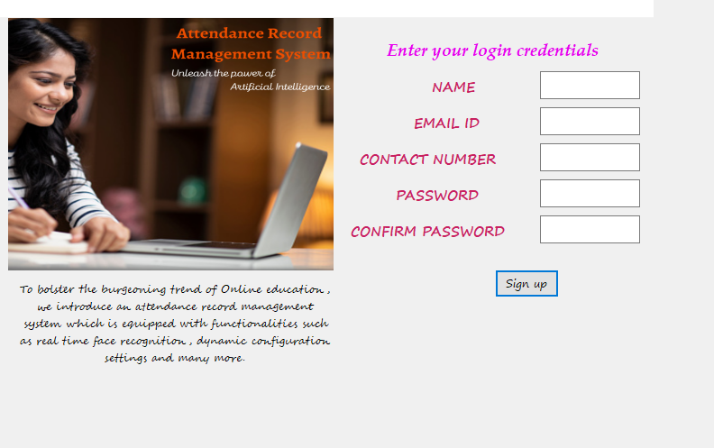

In this application, an attendance record management system is being proposed which, using the power of face recognition systems manages the monitoring of students for attendance marking relaxing the burden of students and speakers from the exhaustive work of marking the attendance.

Following are some snips of the system in action.




# To resolve the Element Ambiguous Error:
1. Go to `application.py` file in pywinauto root folder.
2. In Function `__get_ctrl()` add the following code -

    ```python
    elements = findwindows.find_elements(**criteria[0])
    if len(elements)==1:
        index=0
    else:
        index=1

    dialog = self.backend.generic_wrapper_class(elements[index])
    ```
2. Replace the current dialog variable with this new variable.
